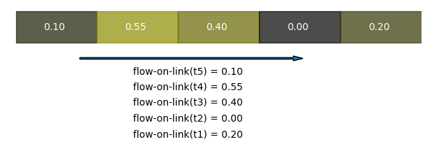
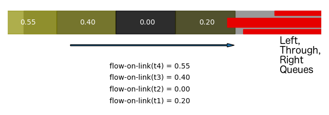
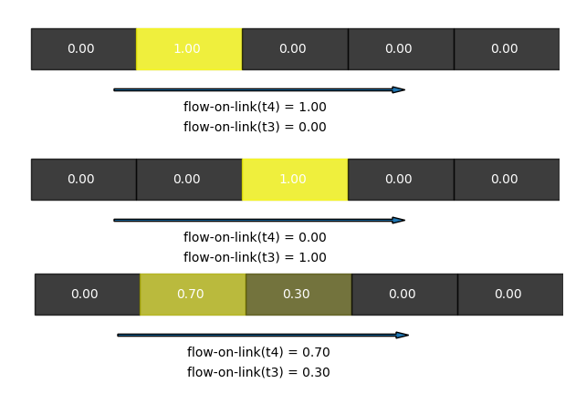
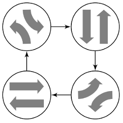
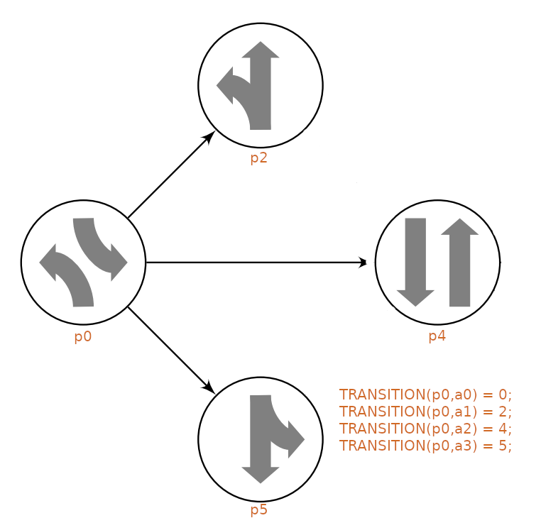

# RDDL implementation of the van den Berg - Lin - Xi (BLX) model
The goal of this document is to describe the BLX traffic model, and to explain some of the details of
its implementation in RDDL.

The document is structured as follows. The first section contains a general description of the BLX model.
The second section discusses some aspects of the RDDL implementation, including how vehicle flow propagation
is implemented, how linear blending of incoming flows works, and the difference between "Simple" and "Complex"
phasing schemes. The final section contains a Start-up guide, which describes how to use the instance file
generator to create a grid network and run the instance as a RDDLEnv using pyRDDLGym.


## BLX model
The BLX model is a model of traffic flow. The model abstracts away the motions of individual vehicles, instead
keeping track of flows that move at some constant propagation speed. Nevertheless, the model is 
detailed enough to capture several different traffic modalities (undersaturated, saturated, and
oversaturated flow). For some applications, such as traffic signal control, the level of detail captured
by the model may be sufficient for reaching good performance (when combined with a good planning algorithm).

The BLX model propagates traffic flows along the links of a traffic network in discrete time-steps of equal
duration[^1].
By a link, we mean piece of road connecting two intersections or connecting an intersection to the boundary of
the traffic network. If the traffic network is thought of as a directed graph, "link" is another name for
a directed edge. Each link may have several incoming turns from other links, and several outgoing turns
to other links. Each turn has some number of incoming lanes, which affects the saturation flow rate of the
turn, i.e. the highest rate at which the turn can drain traffic (for simplicity we assume that the number
of lanes does not change throughout the link). The number of lanes on the link is equal to the sum of the
number of lanes over all of its outgoing turns.

For each outgoing turn on a link, the model keeps track of:
 - The current queue length (number of stopped vehicles waiting to make the turn)
 - The flows along the link (more precisely, the flow that is arriving to the queue
   in 0, 1, 2, 3, ... seconds)

Incoming flows are assumed to propagate at some constant speed along the link (the value of the speed may depend on the link),
until joining the upstream end of the queued vehicles. Upon reaching the queued vehicles, the flows are divided up
into the queues for each outgoing turn. The amount of inflow to the queue for a particular turn is computed by multiplying
the inflow by the probability of the turn.

The outgoing flow of a turn that has a green light is determined as the *minimum* of the following three terms:
 - The sum queue length + current incoming flow
 - Saturation flow rate (parameter of a turn)
 - Remaining storage of the downstream (target) link (the maximal storage capacity is a parameter of a link)

In this way, BLX models three different traffic modalities. Respectively, they are:
 - Undersaturated flow (there are few enough vehicles in the queue and currently arriving that they can be totally cleared)
 - Saturated flow (as many vehicles as possible are cleared in the time-step)
 - Oversaturated flow (saturated flow cannot be reached because of limits on downstream capacity)

The BLX model can be used for evaluating various control or planning methodologies. The current RDDL
implementation controls the states of the traffic lights in the network in order to minimize
the total travel time of the vehicles in the network. The actions available for each traffic
light either advance the current green phase, or switch to another phase, subject to timing
constraints (such as requiring each phase to serve some MIN time before being allowed to advance).

More detailed information may be found by inspecting the domain RDDL file, or referring to the paper

 > S. Lin, B. De Schutter, Y. Xi, and J. Hellendoorn, "A simplified macroscopic urban
   traffic network model for model-based predictive control," Proceedings of the 12th
   IFAC Symposium on Transportation Systems, Redondo Beach, California, pp. 286--291,
   Sept. 2009

It may also be helpful to look at the similar Queue Transmission Model, which appeared in

 > Guilliard, I., Sanner, S., Trevizan, F. W., & Williams, B. C. "Nonhomogeneous
   time mixed integer linear programming formulation for traffic signal control,"
   Transportation Research Record, pp. 128--138 2595(1), 2016

## RDDL implementation
We now describe several details of the RDDL implementation of the BLX model to help
the reader's understanding.

### Vehicle flow propagation in RDDL (Why is time encoded as an object?)
A special feature of the BLX model that is a bit tricky to deal with from the MDP perspective is that the incoming flows
join the end of a queue with a time offset (the time it takes the flow to propagate from entrance until reaching the queue).
It becomes necessary to keep information from previous time-steps as part of the state.

For example, let us imagine that the link is 100 m long, and the propagation speed is 20 m/s. In addition, let the model operate with a time-step of 1 s.
First, imagine that the queues are empty. Then the vehicle flows that are entering the link at the current time-step will be arriving at the downstream end of the link in
100/20 = 5 s (time-steps). For scheduling the traffic light phases, it is important to know the full picture of the incoming flows,
that is, how many vehicles will be arriving in 0, 1, 2, 3, 4, 5 seconds.

In the following image, an inflow of 0.20 arrives at the downstream link end in 1 time-step, followed by inflows
of 0.0 in 2 time-steps, 0.40 in 3 time-steps, and so on.


We can encode all of this information into an array-like object
```
flow-on-link(time)
```
where ``time`` is a RDDL object that has instances t0, t1, t2, t3, t4 and t5.



Although RDDL does not provide a native mechanism for accessing array elements, we can mimic this as follows.
For each time object, we define a ``TIME-VAL(time)`` non-fluent, which acts as the array index. Then, if ``tau``
denotes the propagation time to the end of queue (it could be 3 seconds, for example) and ``flow-into-link``
denotes the incoming vehicle flows, we can add the new flows as
```
flow-on-link'(?t) = (TIME-VAL(?t) == tau) * flow-into-link;
```

If the queues are not empty, we would like to find the time that the incoming vehicle flows take to reach the
*upstream end* of the queue. This time will necessarily be <= 5 seconds. Therefore, with non-empty queues we
can continue using the same ``flow-on-link(time)`` array-like object to record the inflows.

The following image illustrates how the arriving flows look like when there are non-empty queues.
Note that the propagation time to the end of queue is estimated by summing the total number of
queued vehicles and finding the space they occupy, so that the "queue line" used for estimating
propagation time is obtained as a weighted average of the queues.



Network-wide, we need as many ``time`` object instances as the longest possible propagation time among all
of the links in the network.

The preceding describes how new inflows are added into the "propagating flows array". 
To propagate previously entered flows along the link, we need in addition to define a sequential
ordering on the time objects (a successor function like in Peano arithmetic). We implement this using
the boolean non-fluent ``NEXT(?ta,?tb)``, where for example ``NEXT(t2,t3)`` is true, but
``NEXT(t2,t4)`` and ``NEXT(t3,t2)`` are false. Using the ``NEXT`` concept, we can propagate flows as
```
flow-on-link'(?t) = (sum_{?tb : time} [ NEXT(?t,?tb) * flow-on-link(?tb) ]);
```
Please note that when a flow gets propagated its index (time until reaching the queue) gets
decreased by one, not increased.

Putting the incoming and propagated flows together, we obtain the update rule
```
flow-on-link'(?t) = (TIME-VAL(?t) == tau) * flow-into-link + (sum_{?tb : time} [ NEXT(?t,?tb) * flow-on-link(?tb) ]);
```

### Linear blending of incoming flows
If we compare the update rule for ``flow-on-link(?t)`` described in the previous subsection with the update rule used in the
RDDL domain files, we see that there is an additional detail that is still missing. This is linear blending of incoming flows.

To illustrate, imagine that we are getting a 10 vehicle inflow into our link, and that the estimated propagation time to the end
of the current queue is equal to 8.3 time-steps. Should we round up or round down 8.3 to find the time-index where
the inflow is inserted into the ``flow-on-link(?t)`` "array"? Because at different times of the simulation the
estimated propagation time could in principle take values 8.01, 8.49, 8.51, or 8.99 (for example), the floor, round, and ceiling
operations can all be fairly inaccurate at different steps within the simulation.

Therefore, instead BLX *linearly blends* the incoming flows into two adjacent entries of the ``flow-on-link(?t)``
array. Some of the inflow goes into the 8-second-offset and some of the inflow goes into the 9-second offset.
The split is done linearly. In the example, because 8.3 is closer to 8 than to 9, more of the inflow should
go into the 8-second-offset. ``(1-0.3)*10`` goes into 8-second offset and ``0.3*10`` goes into 9-second offset.

The following picture illustrates the point (in a situation with a shorter propagation time and smaller 
flows):


More generally, we write the propagation time estimate as ``tau + gamma``, where ``tau`` is an integer and ``gamma``
is a real number in the interval [0, 1). Then the incoming inflow is linearly blended as

```
flow-on-link'(?t) =  (TIME-VAL(?t) == tau) * (1-gamma) * flow-into-link
                   + (TIME-VAL(?t) == tau+1) * gamma   * flow-into-link;
```

We have now explained all of the elements of the ``flow-on-link`` update rule in the RDDL
implementation: registering the incoming flows using linear blending, and propagating
the flows (the latter in the previous subsection).

### Simple and Complex phasing structures
We now explain the difference between the "Simple" and "Complex" phasing structures implemented 
for the RDDL BTX domains.

#### Simple phasing
In the "Simple phasing" version of the domain, the phases follow a static four-phase cycle with
intermediate ALL-RED phases. The phases always appear in the same order. An action is a boolean
``advance(?i)`` for each controlled intersection.
If ``advance(?i)`` is true (and the timing constraints like MIN and MAX times are satisfied), then
the phase advances to the next phase.

Although in principle, the four phases in the cycle can be arbitrary, by convention they are called
"West-East Left", "West-East Through", "North-South Left" and "North-South Through". This represents
a typical four-phase cycle with leading protected left phases followed by a through phase, as
illustrated in the following image:



#### Complex phasing
In real-world applications, it is common to use a more complex phasing scheme than the four-phase
cycle with protected left turns. For example, in the NEMA standard, the phasing scheme permits
one or both of the protected left phases to be skipped.

The following image illustrates the NEMA phasing scheme. Each vertex of the directed graph represents
a phase (the arrows indicate which turns get the green light), and there is an arrow between two 
vertices if the phase transition is allowed:


In order to represent NEMA as well as other more complex phasing schemes, a "Complex phasing" version
of the TrafficBLX domain is provided in addition to the "Simple phasing" one. Inspired by the NEMA
graph above, we define a phasing scheme to be a directed graph. The vertices of the graph are the
set of possible phases. There is a directed edge between two phases if the phase transition is allowed.

The simple phasing scheme may also be represented in this way, as a directed cycle with four vertices.

Because there are now in principle several possible transitions from each phase, the action
space is no longer a boolean for each controlled intersection. In order to represent the possible
transitions, we *fix an enumeration* of the phases, and *fix an enumeration* of the phase transitions
for each phase. We also create ``action-token`` objects ``a0, a1, ..., an``, enough to represent all
possible phase transitions (for NEMA, ``a0, a1, a2, a3, a4`` suffices). In practice, ``action-token``
objects are used for "array-lookup" into the dynamically-sized arrays of permitted phase transitions
from a given phase.

For example, we focus on one of the phases and its allowed transitions. Here, we gave arbitrary
indices to the four phases for illustration, which is fine as long as the indices are some
permutation of 0, ..., (#phases-1).



There are four possible transitons from the phase ``p0``. The transition with index 0 and action token ``a0`` 
is by convention always the one that takes the phase to itself (i.e. extends the phase by one time-step). 
Transition with index 1 (corresponding to action token ``a1``) takes ``p0`` to ``p2``. This is represented
by the non-fluent ``TRANSITION(p0,a1) = 2;``. Similarly, the transition with index 2 goes to ``p4`` and 
transition with index 3 goes to ``p5``.

For each intersection, then, the action is an integer called ``set-phase`` (the integer gets clipped below at 0 and above at
the highest number of possible action tokens). For example, if the action at one of the intersections ``3`` and the
intersection is currently in phase ``p4``, we look up ``TRANSITION(p4, a3)``. Say the value of ``TRANSITION(p4, a3)``
is ``7``. The action is then interpreted as "transition from phase ``p4`` to phase ``p7``"

We expect that this kind of action encoding may be quite tricky to work with! So we encourage the reader to always
start with the SimplePhases version of the domain. Nevertheless, it may be of some interest to look at the
ComplexPhases version at a later point, especially if one wants to compare performance to existing methods
used in the field.


## Start-up guide
In the final section, we run through the steps necessary to generate a
domain instance using the instance generator and run it as a pyRDDLGym
environment.

### Generating a domain instance
The script ``netgen.py`` contained in the same directory as this README may be helpful for generating
example instances of the traffic domains (either with Simple or with NEMA phasing). The features of the
instance generator are fairly limited, and the user may wish to build upon it, develop their own, or
simply create the desired instance files by hand instead.

#### Basic functionality
For basic functionality, run
```
python netgen.py -r <ROWS> -c <COLS> -p <'simple' or 'nema'> <path/to/new/instance/file>
```
where variables in ``<ANGLULAR BRACKETS>`` denote user input.

#### Example: 3x4 Grid with Simple Phasing
We run
```python
python netgen.py -r 3 -c 4 -p simple SimplePhases/example_3x4_simple_grid_instance.rddl
```
Upon success, the message
```
[netgen.py] Successfully generated the network instance RDDL file to SimplePhases/example_3x4_simple_grid_instance.rddl
```
appears, and the instance file is created at the specified path.
The generator creates the following 3x4 grid network, here controlled by a random agent.


There is certainly a lot of room for improvement over the random agent!

#### Example: 2x3 Perturbed Grid with NEMA Phasing
We run
```python
python netgen.py -r 2 -c 3 -p nema --off-grid ComplexPhases/example_2x3_nema_grid_instance.rddl
```
Upon success, the message
```
[netgen.py] Successfully generated the network instance RDDL file to ComplexPhases/example_2x3_nema_grid_instance.rddl
```
shoud appear, and the instance file created at the specified path.
The generator creates the following 2x3 grid network with off-grid perturbations (again controlled by a random agent)


#### Additional options
- Passing the command-line argument ``-T <int>`` or ``--horizon <int>`` modifies the instance horizon from the default of 200.
- Passing the command-line argument ``-L <prob>`` or ``--high-left-prob <prob>`` modifies the probability
that an intersection has higher left-turn proportions than the through movement. By default, this probability
is zero (so that all intersections have higher probability of through movement).
- Passing the command-line argument ``--off-grid`` perturbs the intersections off-grid by a normal random vector,
making the network a bit less symmetric.
- Passing the command-line argument ``-f`` or ``--force-overwrite`` makes the generator overwrite an existing
  file (the default behaviour is to quit if the target path already exists

The demand and network geometry attributes may be modified by directly modifying the ``generate_grid`` function
in the ``netgen.py`` script. Currently, specifying demand or geometry attributes from the command line is not supported.


### Running and interfacing with an instance as a RDDLEnv
The instance files can now be used to create a pyRDDLGym environment following the standard
steps. For example, the following runs a random agent to control the 3x4 grid network with Simple
phasing constructed in the previous subsection. The code is mostly borrowed from the examples in
the pyRDDLGym documentation. It is assumed that pyRDDLGym is installed.

```python
import pyRDDLGym
import pyRDDLGym.core.policy

env = pyRDDLGym.make(
    domain='SimplePhases/domain.rddl',
    instance='example_3x4_simple_grid_instance.rddl')

agent = pyRDDLGym.core.policy.RandomAgent(
    action_space=env.action_space,
    num_actions=env.max_allowed_actions)

cmlt_reward = 0
state, _ = env.reset()
for step in range(env.horizon):
    env.render()
    action = agent.sample_action()
    next_state, reward, terminated, truncated, _ = env.step(action)

    cmlt_reward = cmlt_reward + reward
    state = next_state
    if truncated or terminated:
        break

print(f'Episode ended with cumulative reward {cmlt_reward}')
env.close()
```
Note: For complex phasing, the action space is nominally all integers, but it is typically clipped
between 0 and a low positive value, so that almost all positive integers encode the same action. Therefore, to generate random
actions it is better to do this manually using ``random.randit(0,5)``, for example


[^1]: In principle the duration may be made to vary, as was done in the Queue Transmission Model (QTM),
which is similar to BLX.

